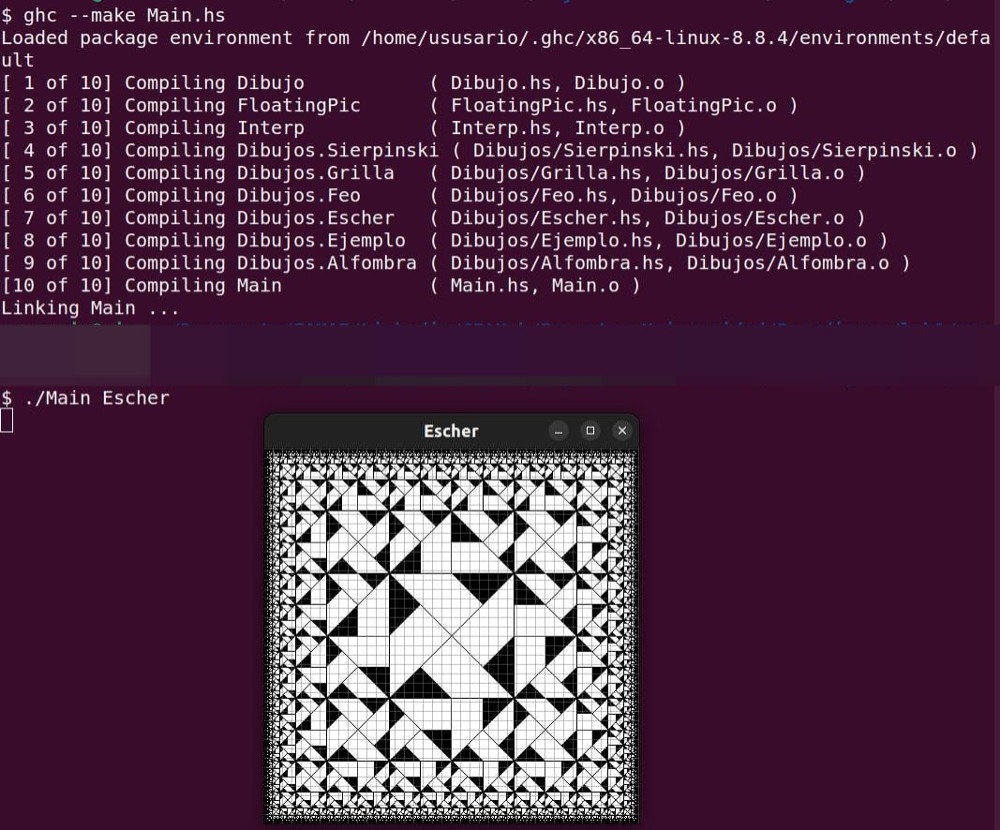
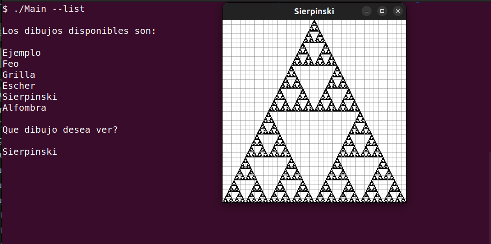
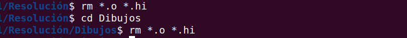

#Guía
Primero debe abrir una terminal sobre el directorio "Resolución"
Luego ejecutar el comando "ghc --make Main.hs", con esto ya se compilaron todos los archivos necesarios.
Por ultimo ejecutar "./Main 'nombre_del_dibujo'"

O para mostrar la lista de dibujos disponibles ejecutar "./Main --list"

Antes de salir puede eliminar los archivos compilados de la siguiente manera:
