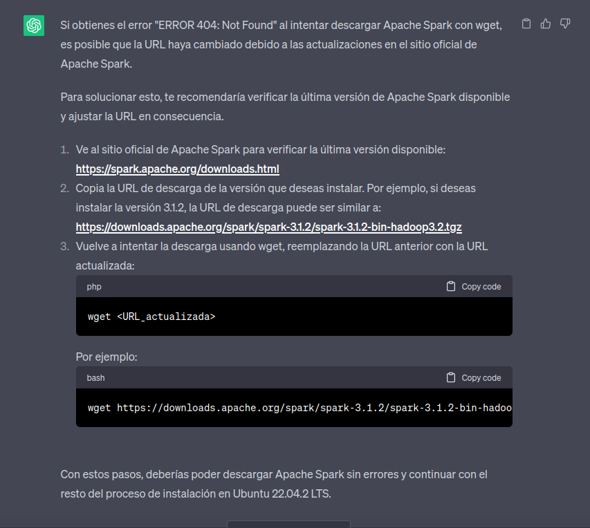
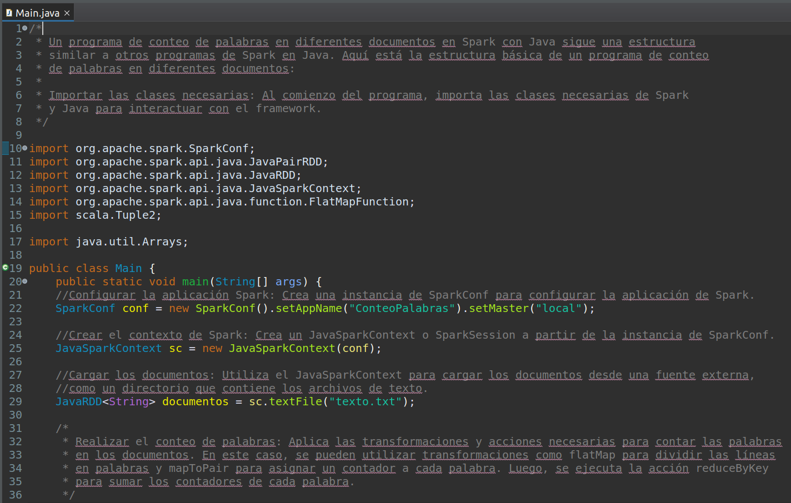
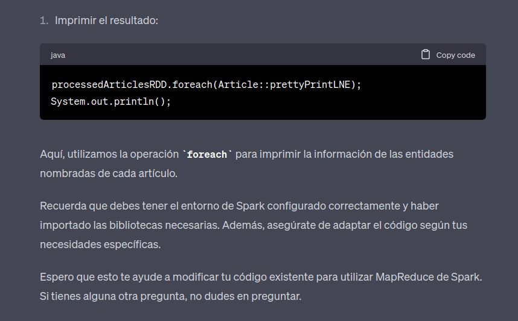
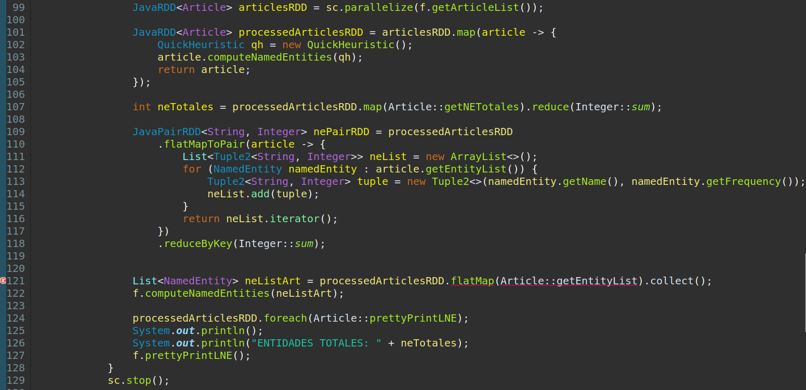

# Laboratorio 3:Programación asistida para Frameworks sobre Cálculo Distribuido

---
## Objetivo:
En este laboratorio vamos a re-implementar el lector automático de feeds del Laboratorio 2 sobre una arquitectura distribuida, a través del framework Spark, utilizando como lenguaje de programación Java. Además, vamos a aplicar diferentes aproximaciones para hacerlo: programación asistida por inteligencia artificial, ejemplos de proyectos tipo o consultas a sitios de referencia.

**Voy a documentar mi proceso para resolver el proyecto utilizando como estrategia chatGPT, una inteligencia artificial generativa orientada a diálogo general.**

---
# Proceso
---
Primero lo que debemos hacer es instalar Spark en nuestra maquina. Para ello le pregunte a chatGPT lo siguiente:

Y obtuve como respuesta

Pero al realizar el punto 3 usando wget me tiro el siguiente error

Así que le pedí ayuda a chatGPT

Asi que modifique el numero de version con la ultima disponible en https://spark.apache.org/downloads.html

---
Luego le pregunté:

---
Luego le hice la siguiente pregunta

Me dio una explicación utilizando un ejemplo simple, el cual lo pase a eclipse directamente para probarlo:

Pero al correrlo me tiraba la siguiente excepción

El cual al preguntarle a chatGPT

Primero lo que hice fue actualizar java a la versión 11 y la agregue a eclipse.
También fue necesario añadir los jars que se encuentran en el directorio de spark.
Intente correr el programa de nuevo y funciono:

Por otro lado, conversando con mis compañeros de grupo, me enseñaron otro código de ejemplo en el cual antes de poder correrlo había que crear un Maven project, crear un archivo log4.properties, un pom.xml y configurarlo con las dependencias correspondientes.
Como buena práctica y para minimizar posibles errores, lo incorpore a mi proyecto de ejemplo. Igualmente no obtuve ningún cambio que se pueda apreciar y siempre aparecian los mismos mensajes por consola:

Realice la siguiente consulta

Pero no me sirvió. Intenté muchas veces, preguntando de diferentes maneras, pero nada me ayudaba a solucionarlo. Hasta que pregunte lo siguiente:

Por suerte desaparecieron todos los mensajes de tipo INFO!

Así que le pregunte a chatGPT que hacia el código que estaba en log4.properties.

Y ahora puedo decir que esa es la estructura que debería tener un programa de conteo de palabras en diferentes documentos en Spark:

---
## ¿Cómo adaptar el código del Laboratorio 2 a la estructura del programa objetivo en Spark?

Entonces fui realizando estas modificaciones en mi codigo.

Pero tenia un error:

Busque como solucionarlo

Pero como no obtuve una respuesta que me sirva, hice lo siguiente

(Compartiendole solo la parte del codigo que usa Spark)

Esto mismo fue tambien necesario para la clase NamedEntity

Logre correr el programa con la misma funcionalidad del lab 2, salvo por una excepción:
No contabiliza las entidades nombradas por categoria
| lab 2                                                                                                     | lab 3                                                                                                     |
| ----------------------------------------------------------------------------------------------------------- | ----------------------------------------------------------------------------------------------------------- |
|                      |                      |

Esto sucede porque al crear la lista de entidades nombradas lo hago con null en vez de la categoria y topico correspondiente.

Intene resolverlo pero no hubo caso.

---
Para finalizar le hice una ultima pregunta a chatGPT

