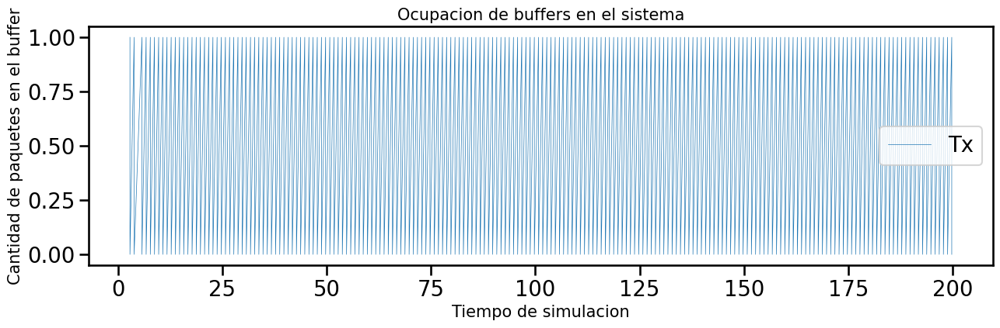
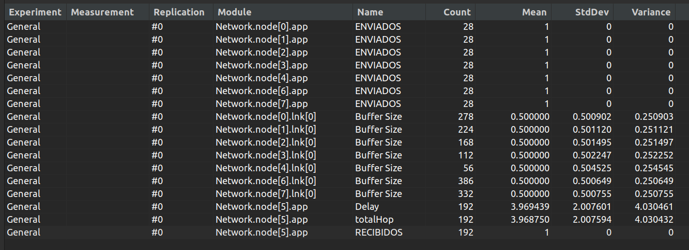
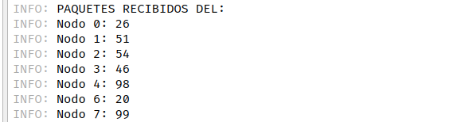

# Análisis de algoritmos de enrutamiento en redes utilizando simulación discreta

## Integrantes:
* Lucía Daniela Lotumolo Sueldo
* Nicolás Xynos
* Juan Ignacio Méndez

## Resumen
 La capa de red es la principal responsable del correcto direccionamiento de los participantes en una red. El objetivo de este estudio es comprender como se comporta la red con diferentes algoritmos de enrutamiento y con diferentes generadores de paquetes a través de una simulación. Por un lado estudiamos un algoritmo que transmite paquetes siempre en sentido horario, esto generaba una red desequilibrada. También con el mismo algoritmo cambiamos la frecuencia de generación de paquetes para equilibrar la red. Por otro lado diseñamos un algoritmo que tiene en cuenta la paridad del nodo origen de los paquetes, para poder tomar decisiones de enrutamiento con respecto a eso. De esta forma mejoramos la cantidad de paquetes recibidos, manteniendo las otras métricas parecidas al algoritmo anterior.

## Introducción

Una red es un conjunto de dispositivos que intercambian datos y recursos, y su rendimiento es un aspecto esencial. En trabajos anteriores nos dedicamos a estudiar los problemas de congestión y de flujo en el intercambio de paquetes en una red, y cómo estos afectan al rendimiento de la misma. Sin embargo, existen otros factores que influyen en el rendimiento, y uno de ellos es la topología de la red. La forma en que cada dispositivo y enlace está organizado en una red y cómo fluyen los datos a través de ellos puede afectar la calidad de servicio.
La capa de Red, dentro de una arquitectura de protocolos de redes de computadoras, es la que se encarga de llevar los datos, o mejor dicho paquetes, desde el origen hasta el destino. Para  lograr  sus  objetivos,  la  capa  de  red  debe  conocer  la  topología  de  la  red y elegir las rutas apropiadas. También debe tener cuidado al escoger las rutas para no sobrecargar algunas  de  las  líneas  de  comunicación  y  los  enrutadores,  y  dejar  inactivos  a  otros. 
Si bien la capa de red es independiente de la topología de red, es decir puede funcionar sin importar cómo estén físicamente conectados los dispositivos, tendremos en cuenta un modelo para nuestros estudios. La topología de anillo es una configuración de red donde las conexiones de los dispositivos crean una ruta circular de los datos. Cada dispositivo en la red está conectado cabalmente a otros dos, el de adelante y el de atrás, formando así una ruta continua única para transmitir la señal, como los puntos en un círculo. Se puede usar la siguiente imágen para una mayor comprensión de la red que analizaremos. 

Internamente, cada nodo cuenta con dos capas de enlace (lnk, una con cada vecino), una capa de red (net) y una capa de aplicación (app). La capa de aplicación y la capa de enlace implementan generadores de tráfico y buffers respectivamente, tal como usamos en nuestro trabajo anterior. Entonces, cada nodo se podría visualizar como la siguiente imagen.

Conceptualmente, estudiaremos el rol de la capa de red, que deberá decidir por qué interfaz enviar los paquetes que le llegan ya sea desde la capa de aplicación superior o desde las capas de enlaces inferiores. En otras palabras, estaremos trabajando en el problema de enrutar el tráfico que confluye en este módulo de múltiples entradas y salidas.
En particular, la capa de red realiza un algoritmo de enrutamiento simple. Cada paquete que ésta recibe es evaluado para determinar si el nodo local es el destino final del mismo. En caso de que lo sea, el paquete es enviado a la capa de aplicación local. En caso de que el paquete esté destinado a otro nodo se elige una interfaz para retransmitirlo. La capa de red que estudiaremos elige siempre la interfaz número 0 (toLnk[0]) que es la que envía el tráfico en sentido de las manecillas del reloj a lo largo del anillo hasta llegar al destino.
Para nuestra investigación, consideramos diferentes nodos como los encargados de generar y lanzar paquetes a la red cada cierto tiempo (interArrivalTime). Por otra parte, estos paquetes tendrán como destino el nodo 5. Incluimos en el modelo dado todas las estadísticas necesarias para analizar el rendimiento del sistema de enrutamiento planteado. En particular incluimos medidas de demora de entrega de paquetes, cantidad de saltos realizados por cada paquete, utilización de los recursos de la red (buffers) y el origen de los paquetes que llegaron al destino.

### Tarea de análisis
#### Caso de estudio 1

Aquí tendremos al nodo 0 y 2 como los generadores de paquetes. El algoritmo de enrutamiento será como ya explicamos anteriormente, los paquetes viajan de nodo a nodo en sentido horario. Estos tienen un tamaño de 125000 bytes, y una duración para procesarlos de 1 segundo. Es importante mencionar esto porque una vez que un paquete llega a la net y esta debe reenviarlo a otro nodo, antes de eso el paquete debe procesarse, esperando en una cola.
Al correr la simulación obtuvimos los siguientes resultados en los vectores que decidimos calcular.

Analicemos los efectos de la simulación en cada vector. La cola “ENVIADOS” guarda los vectores generados y efectivamente enviados por el nodo que lo mantiene en la capa de aplicación. Notamos que el nodo 0 generó 201 paquetes, y el nodo 2 189, obteniendo así 390 paquetes enviados a la red. Sin embargo, no todos llegaron al destino, solo 196 lo lograron. Esto lo podemos evidenciar con el buffer “RECIBIDOS” que fue creado en el nodo 5 y calcula los paquetes que llegaron a la net y posteriormente fueron enviados a la capa de aplicación.

Ahora bien, los paquetes que fueron generados en algún nodo y llegaron a su destino, tardaron 51 ms en promedio hacerlo. También resaltamos que en ese periodo aproximado de tiempo, realizaron 3 o 5 saltos. Pues si fueron generados en el nodo 2, pasaron por el nodo 1, 0, 7, 6 y 5. Mientras que si fueron generados en el nodo 0, viajan a través de los nodos 7, 6 y 5. De esta forma tenemos en promedio 3,91 saltos realizados por paquete.
Por último expliquemos la razón por la que algunos paquetes no llegaron al destino. Por un lado tenemos los paquetes generados por el nodo 2 que en algún momento pasan por la cola del nodo 0, y por otro tenemos los generados por el nodo 0 y que también pasan por su cola. Como esta cola recibe paquetes tanto de su nodo vecino, como desde la capa de aplicación, genera retrasos. Pues al procesarlos en 1 segundo, no va a la velocidad que los recibe. En otras palabras, cada dos paquetes que son guardados en el buffer, uno es sacado y enviado al siguiente nodo. Por lo que sí 390 paquetes fueron enviados, aproximadamente la mitad no debería llegar a destino porque permanecieron en el buffer del nodo 0. El siguiente gráfico muestra como fue el uso de este buffer, creciendo de forma lineal según la conclusión que realizamos.

El buffer comienza con 0 paquetes, y termina con 188 en su interior. Debido a esto, en los vectores tenemos en promedio 92 paquetes para este buffer. Finalmente, como teníamos 390 paquetes generados, 188 en este buffer y 196 que llegaron al destino, tenemos 6 paquetes dando vuelta por la red. La siguiente tabla muestra la transición que estaban haciendo 5 de estos paquetes.

Esto se generó debido a que se terminó la simulación, gráficamente sería así, siendo las trazas azules los paquetes generados por el nodo 2, y las trazas rojas los paquetes generados por el nodo 0.

El paquete restante que anda dando vuelta por la red, en realidad quedó en el buffer del nodo 2, el que lo generó.

Ahora bien, si bien explicamos el uso del buffer del nodo 0, mencionaremos el de los otros nodos. Debido a que el tiempo de generación (interArrivalTime) y el tiempo de procesamiento que requiere cada paquete es casi idéntico, tenemos una salida cada una recibida. 

Este gráfico aplica para los nodos 1, 7 y 6.
Por último decidimos contabilizar el origen de los paquetes que llegaron al destino. Esta métrica será explicada en esta sección del informe pero se utilizará nuevamente para los próximos casos. Se creó un arreglo donde en la posición i se guarda la cantidad de paquetes que llegaron al destino con origen i. Este arreglo tiene tamaño para 250 nodos, por lo que este será el número de nodos que soporta nuestra red. Los datos que obtuvimos para este caso fueron bastante equilibrados, y lo podemos ver en la siguiente imagen.

Otra conclusión importante es que debido a la topología de la red, y el algoritmo de enrutamiento utilizado, tenemos los nodos 3 y 4 en desuso. Modificar la decisión que toma la capa de red para enrutar los paquetes de tal forma que utilice los bufferes de estos nodos, generaría un mejor rendimiento en el servicio.

#### Caso de estudio 2
Ahora tendremos en cuenta todos los nodos restantes para la generación de tráfico hacia el nodo 5, sin embargo tendremos el mismo algoritmo de enrutamiento utilizado con anterioridad, los paquetes viajan en sentido horario.

Notamos que los tamaños de los bufferes crecen y hay una desproporción entre los orígenes de los nodos que finalizan la transición.
Como sabemos que cada paquete tiene su tiempo de procesamiento igual a 1 segundo, la cantidad máxima que puede recibir el nodo 5 será de 200 paquetes en una simulación de 200 segundos. Cada nodo genera paquetes cada 1 segundo aproximadamente, como máximo pueden generar 200 paquetes durante la simulación. Entonces si sumamos la cantidad que puede generar cada uno de los 7 nodos que envían al nodo 5, serían 1400. Pero solo recibe 200 este nodo.
Para obtener un equilibrio entre los nodos y sus buffers(Lnk[0]) podemos hacer lo siguiente:
1. Generar entre los 7 nodos los 200 paquetes que puede recibir el nodo5. Como 200/7 es igual a 28,5714286, cada nodo debe generar 28 paquetes aproximadamente.
2. Si cada nodo genera esa cantidad en 200 segundos, debería generar un paquete cada 7 segundos, pues 200/28,57 = 7

Con esto aseguramos un equilibrio entre los nodos y los buffers van a tener entre 0 y 1 paquete, logrando así un equilibrio en nuestra red de 8 nodos.

De esta forma tenemos los bufferes de los enlaces con un promedio de 0.5 y un equilibrio entre los paquetes que llegan al destino.

> **Una fórmula generalizada para N nodos sería:**
>
>packetByteSize = tamaño de cada paquete en bytes
>datarate = velocidad de transmisión (bits por segundo)
>Time = tiempo de simulación
>M= cantidad máxima de paquetes que puede recibir el nodo destino
>
>Por lo tanto haciendo el siguiente cálculo podemos obtener >M:
>M = Time/ (packetByteSize / datarate)
>
>Ahora debemos dividir M entre los N nodos para determinar cuándo debe generar cada uno.
>
>pkts_por_nodo = M / N
>
>Por último como cada nodo genera esa cantidad en Time tiempo de simulación, debería generar un paquete cada pkt_time , pues Time/ pkts_por_nodo =  pkt_time.
>

### Tarea de diseño

Para esta parte lo que hicimos fue diseñar otra estrategia de enrutamiento basada en que los nodos
pares mandaban los paquetes siguiendo un sentido antihorario, mientras que los impares mandaban
en sentido horario. Este simple algoritmo de enrutamiento permite tener una red mucho más
equilibrada si la comparamos con la red en donde todos los nodos transmiten los paquetes hacia el
sentido horario.

¿Cómo lo implementamos?
La implementación fue bastante sencilla ya que solo tuvimos que modificar un poco el método handleMessage de Net.cc. Una vez que la capa de aplicación envió el paquete, este mismo en cada (capa de red) de los nodos que atraviesa chequea la paridad del número de nodo que lo mando para poder elegir que sentido seguir. De esta forma evitamos loops de enrutamiento que podrían lograr que el paquete nunca llegue a su destino.

#### Caso de estudio 1

Para el caso de estudio 1, la situación no mejoró, ya que los dos nodos transmisores tienen la misma paridad (ambos son pares). Lo que cambió fue que los paquetes en vez de circular en sentido horario, circulan en sentido antihorario. Con esta implementación la gran diferencia se encuentra en que ahora es el buffer node[2].lnk[1] el que crece exponencialmente (frente al node[0].lnk[0] del anterior algoritmo de enrutamiento). La cantidad de paquetes que llegan a la capa de aplicación del nodo 5 es la misma (196), pero ahora cambia la forma en que se distribuyen por parte de los nodos transmisores. Ahora, el nodo 2 envía 10 paquetes más respecto al anterior algoritmo, y el nodo 0 transmite 10 menos.

Como podemos ver a continuación, no todos los paquetes generados por las capas de aplicación de los nodos 0 y 2 llegan a la capa de aplicación del nodo 5. Estas capas de aplicaciones generan 390 paquetes en total (201 del nodo 0 y 189 del nodo 2), pero al final llegan 196. Esto genera un total de 194 paquetes que no pudieron llegar destino, que se encuentran divididos en: 184 están en node[2].lnk[1], 5 en node[0].lnk[1] y 5 en circulación por la red.

#### Caso de estudio 2

En este caso de estudio pudimos notar una mejoría con el nuevo algoritmo de enrutamiento. Esto se debe a que todos los nodos generan paquetes menos el 5, y de acuerdo a la paridad se dividen en dos sentidos de los paquetes. Con este nuevo algoritmo se reciben muchos más paquetes ya que al nodo 5 le llegan tanto del nodo 4 y del nodo 6.

Antes el nodo 5 solo recibía paquetes provenientes del nodo 6, el cual como todos los demás, tiene un datarate de 1Mbps y como el tamaño de los paquetes es de 125000 bytes, por lo tanto tiene un retardo de transmisión de 1s por cada paquete. En cambio ahora el nodo 4 también le envía por el otro sentido, por ende, ahora puede recibir 2 paquetes por segundo, con un máximo de 400 al finalizar la simulación de 200s.

Notamos que los buffers del nodo 6 y 3 nunca van a tener congestión ya que son los primeros nodos que envían para el sentido correspondiente. Ya que no reciben y solo generan, el estado de sus buffers siempre oscila entre 0 y 1.

Esto no pasa con los demás buffers de los nodos 0,1,2,4 y 7 que además de generar, reciben los paquetes de los otros nodos que envían por el mismo sentido. Es por esto que se congestionan los buffers.

## Discusión
El algoritmo propuesto genera una red más equilibrada al tener los paquetes distribuidos en ambos sentidos. Si bien el cambio más significativo fue que se logró duplicar la cantidad de paquetes recibidos, este algoritmo no tiene como interés mejorar el promedio de saltos, ya que no elige la ruta más corta para llegar al destino. Por otra parte, no tiene en cuenta el crecimiento que tienen algunos buffers, por lo que en situación de congestión lo único que hará será desechar paquetes. En trabajos posteriores se podrían considerar estos enfoques, sin dejar de lado el equilibrio alcanzado. 

## Referencias
https://omnetpp.org/documentation/
Redes De Computadoras. Tanenbaum, WetheRall. 5ta edición.
