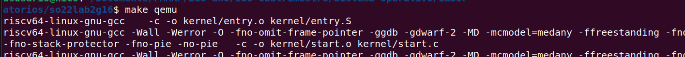
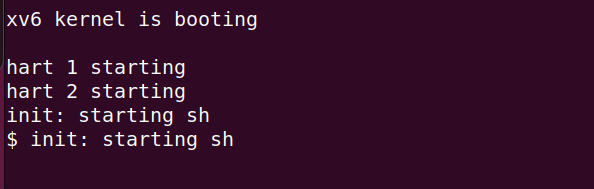
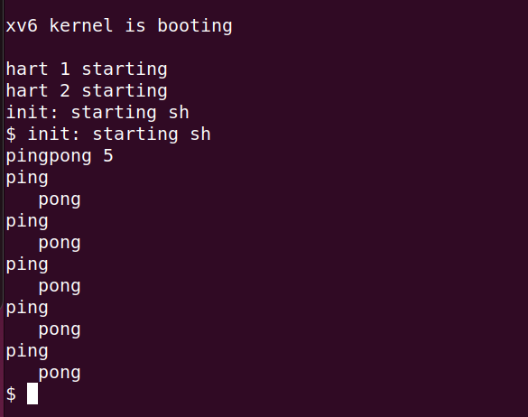
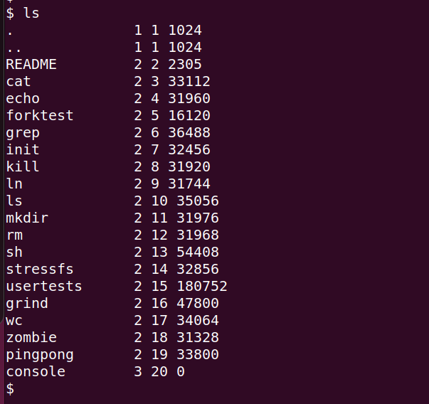

#Guía
Primero debe abrir una terminal sobre el directorio "Resolución"
Luego ejecutar el comando "make qemu", con esto ya se compilaron todos los archivos necesarios.

* Ejecutar "pingpong %" donde '%' lo debe reemplazar por el numero que quiera. Por ejemplo "pingpong 5".

Tambien puede ejecutar el comando "ls" para listar la lista de comandos disponibles.

Antes de salir, asegurese de hacer "make clean" para borrar los archivos compilados.
